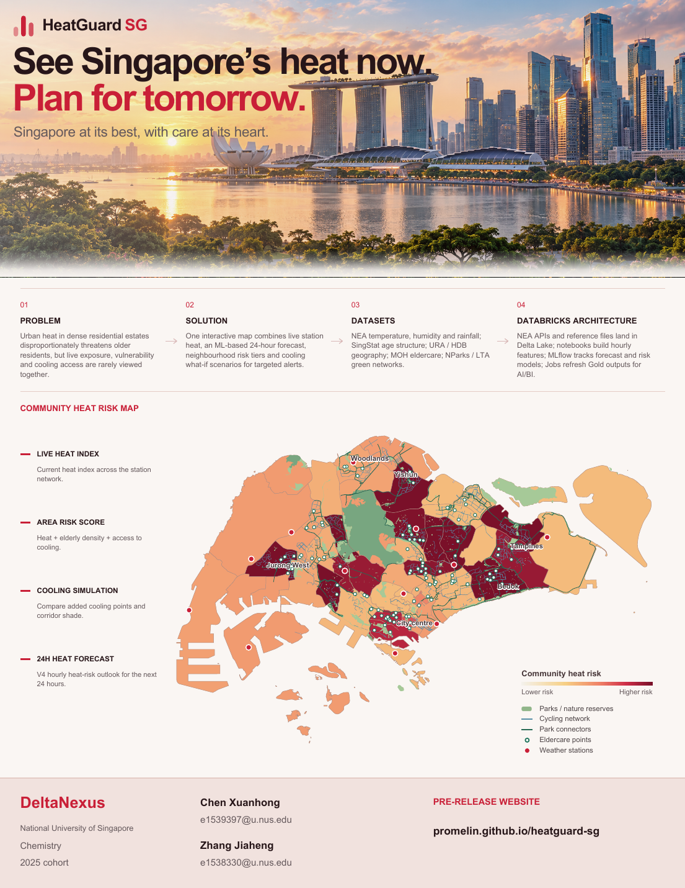

# HeatGuard SG

[HeatGuard SG](https://promelin.github.io/heatguard-sg/) is DeltaNexus's open-source heat-planning dashboard for Singapore. It combines current station heat index, a planning-area Heat Risk Score, cooling-infrastructure scenarios and a 24-hour V4 forecast in one map-led interface.

[](docs/HeatGuard-SG-Concept-Poster.pdf)

**[Open the live dashboard](https://promelin.github.io/heatguard-sg/)** · **[Download the one-page concept poster](docs/HeatGuard-SG-Concept-Poster.pdf)**

## Contributors

**DeltaNexus:** Chen Xuanhong and Zhang Jiaheng, National University of Singapore, Chemistry, 2025 cohort.

<table>
  <tr>
    <td align="center">
      <a href="https://github.com/fromzerotoinfinityplus">
        <br>
        <sub><b>@fromzerotoinfinityplus</b></sub>
      </a>
    </td>
  </tr>
</table>

Full project credits are recorded in [CONTRIBUTORS.md](CONTRIBUTORS.md).

## Implemented modules

- **Live Heat Index** — current heat-index conditions across the weather-station network, with observation and refresh times.
- **Area Heat Risk** — a policy-calibrated random-forest score that combines forecast heat, official 2026 age structure and mapped eldercare access across 55 planning areas.
- **Cooling Simulation** — selectable parks, cycling routes and park connectors, area-specific green baselines, adjustable cooling points and corridor shade.
- **Next-Day Forecast** — a V4 Temporal Fusion Transformer forecast for hours 1–24, selectable by planning area with an hourly curve and risk guidance.
- **Community Data** — structured, privacy-minimised collection for green-pocket proposals, build confirmation, monthly condition checks and on-site comfort feedback.

The public site also includes planning-area and subzone demographics, close-zoom HDB building detail, a ranked priority queue, model evidence and the completed DAISI B1 delivery flow.

## Repository layout

```text
backend/          FastAPI service, weather ingestion and model runtime
backend/model/    V4 TFT and planning-area risk-model weights
dist/             GitHub Pages website, spatial layers and published forecast
docs/             Concept poster and project visuals
reports/          Held-out validation evidence
scripts/          Forecast publication, model validation and data-build tools
```

## Run locally

Use Python 3.10 or newer. The project was developed in the local `cueq` environment.

```bash
conda activate cueq
python -m pip install -r backend/requirements.txt
cp backend/.env.example .env
python run_live.py
```

Open `http://localhost:8000`. The service exposes `/api/health`, `/api/heatguard-data.json` and `/api/community-submissions`, and serves the website from the same origin. Community records and photos are private backend runtime data and are excluded from Git.

For a website-only preview:

```bash
python -m http.server 8001 --directory dist
```

Open `http://localhost:8001`. HTTP serving enables the lazy-loaded HDB and green-infrastructure layers.

## Reproduce inference

The repository includes both released model artefacts:

- `backend/model/best_model.pt` — V4 history-only full Temporal Fusion Transformer.
- `backend/model/risk_model.joblib` — policy-calibrated planning-area random forest.
- `backend/model/v4_runtime_metadata.json` — feature order and training normalisation used by the V4 runtime.

Install CPU PyTorch and the inference dependencies, then publish a fresh result:

```bash
python -m pip install torch==2.6.0 --index-url https://download.pytorch.org/whl/cpu
python -m pip install -r requirements-inference.txt
python scripts/publish_forecast.py
```

`DATA_GOV_SG_API_KEY` is optional and belongs in a local `.env` file or GitHub Actions secret. No credentials are stored in this repository. The scheduled workflow recomputes forecasts from current public observations and commits only the updated result file.

## Data sources

- data.gov.sg / NEA: air temperature, relative humidity and rainfall
- URA: planning-area and subzone boundaries
- SingStat and HDB: 2026 age structure and building context
- MOH: eldercare-service locations
- NParks: parks, nature reserves and Park Connector Network
- LTA: cycling network

Detailed spatial provenance is recorded in `dist/data/spatial/metadata.json`. HeatGuard SG is designed for planning review with human oversight; public health actions should continue to follow official Singapore guidance.

## License

Released under the [MIT License](LICENSE). Source datasets remain subject to their respective providers' terms.
